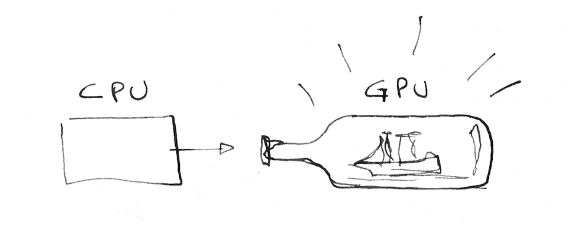

# gl_FragCoord

비슷한 원리로, GLSL은 내장 아웃풋 값들을 가진다. `vec4 gl_FragCoord` 또한 내장 인풋 값도 있다. screen fragment 상에서 pixel의 위치를 가지고 있는 vec4 gl_FragCoord로 각 쓰레드가 빌보드의 어떤 부분을 작업하고 있는지 알 수 있다. 그래서 이값은 uniform 값과는 조금 다르다. 각 쓰레드마다 `값이 다른 varying` 타입이기 때문이다.

```c
#ifdef GL_ES
precision mediump float;
#endif

uniform vec2 u_resolution;
uniform vec2 u_mouse;
uniform float u_time;

void main() {
	vec2 st = gl_FragCoord.xy/u_resolution;
	gl_FragColor = vec4(st.x,st.y,0.0,1.0);
}
```

위 코드에서 우리는 빌보드상의 각 픽셀의 위치를 normalize 했다. 이렇게 함으로 인해서, 값은 `0.0`에서 `1.0`사이로 변환되고, 이 값은 RED와 GREEN 채널에 바로 대입할 수 있게 된다.

아쉽게도, 쉐이더 작업에서 우리는 많은 디버깅 혜택을 볼수가 없다. 그래서, 값을 색에 대입해 예측하고는 한다. 그래서 이 과정을 아래 그림과 같이, 유리병안에 배모형을 조각하는것과 비슷하다고도 한다. 다소 복잡할 수 있지만, 그에 비례한 아름다운 결과는 결코 작지 않다.


